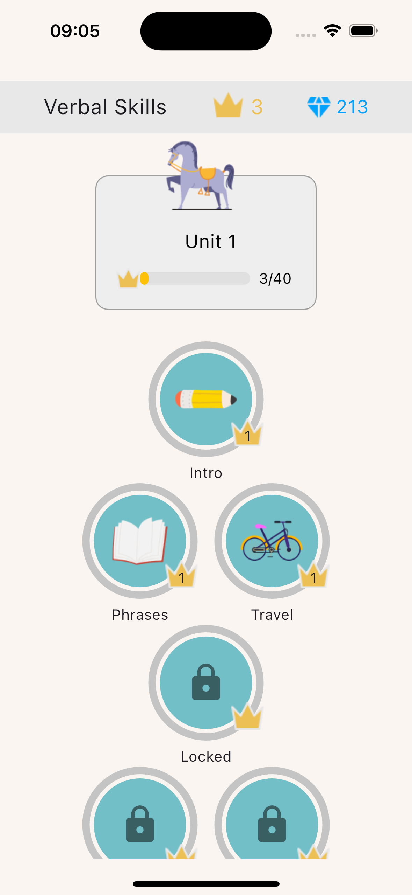
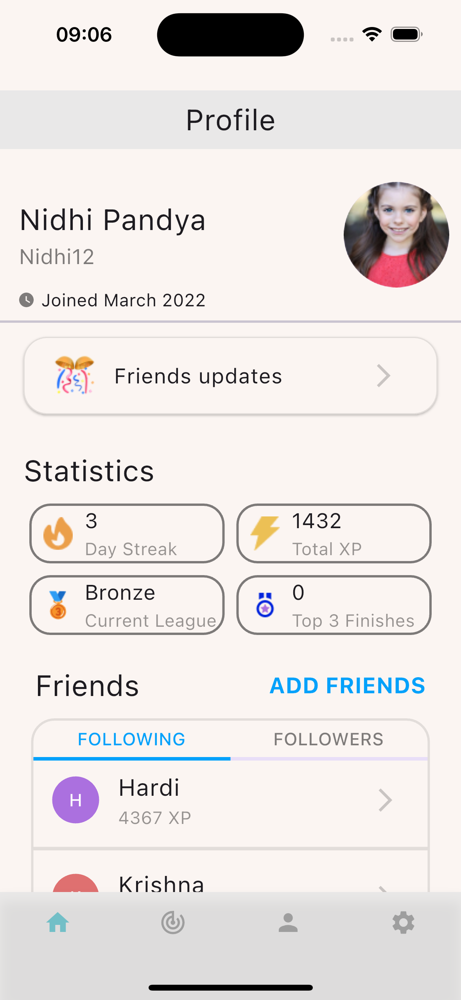
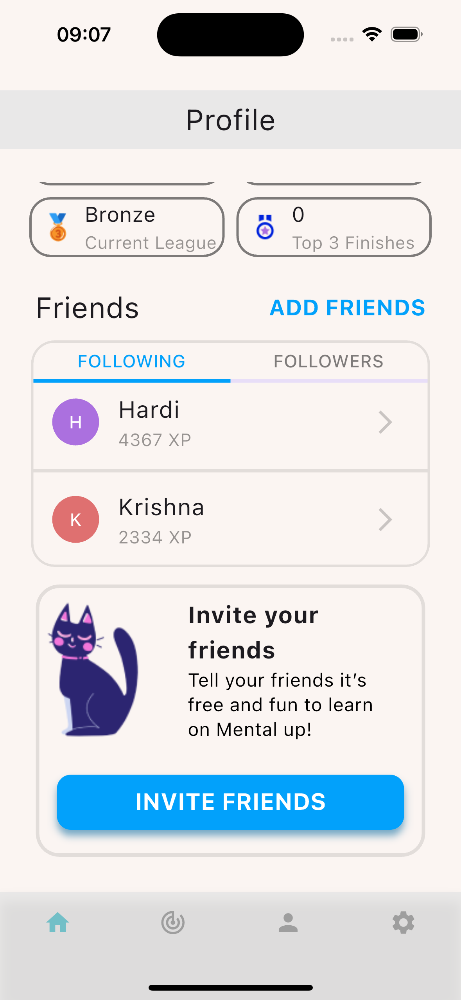
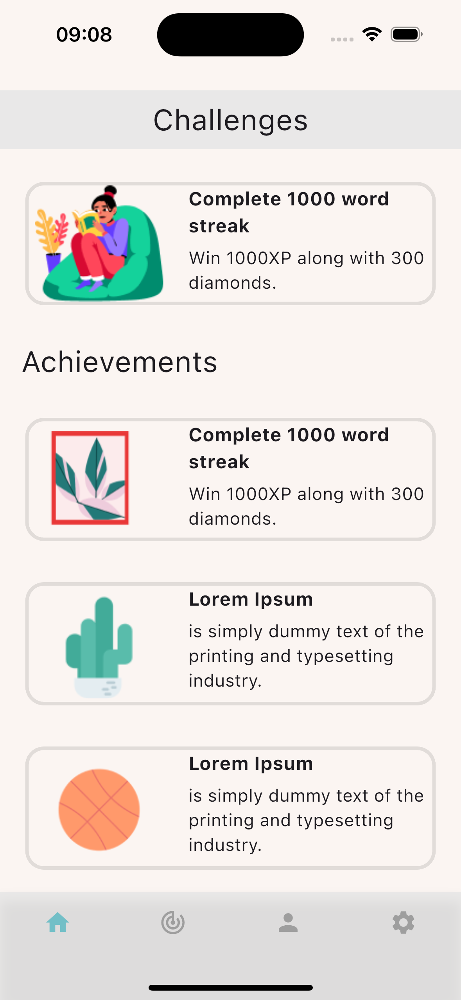

<p align="center">
   
<br/>
   <span style="font-size:30px">Project 3 - UI to Implement</span>
</p>

<hr/>

## Table of Contents

- [ScreenShot](#screenshot)
- [How to run the app](#how-to-run-the-app)
- [Wrote By](#wrote-by)
- [Supervisor By](#supervisor-by)

## UI to Implement

You are required to implement the following Figma design user interfaces:

- [Figma Design - Educational Kids Game](https://www.figma.com/file/hr7vmPgtKJd95quaTZr5bt/Educational-kids-game-(Community)?type=design&node-id=0%3A1&mode=design&t=z9KUqxH5qF2QA9xp-1)

## ScreenShot







## How to run the app

```sh
flutter run
```

## Wrote By

- Fahad Alharbi - student at Tuwaiq Flutter Bootcamp 2024

## Supervisor By

- Fahad Alazmy
- Mjd Alghamdi
- Lujin Bugas