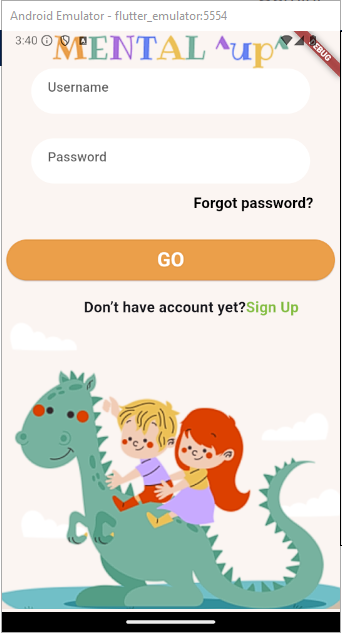
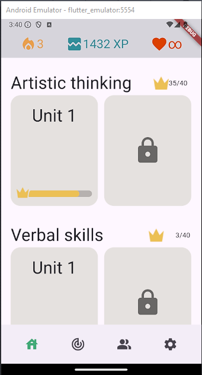
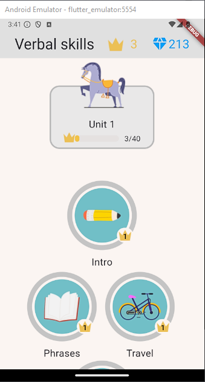
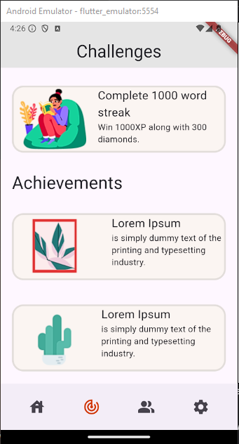
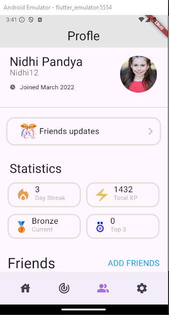
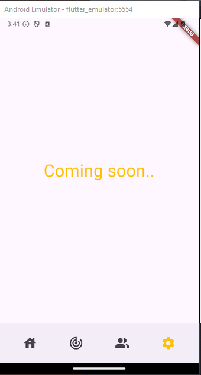

# Mobile Application Educational Kids Game

This project is a basic mobile application with a login screen and a home screen. It's currently under development, but this README provides an overview of the functionalities.

# Application Structure

The application consists of two main screens:

# Login Screen (home_screen.dart)

<ul>
<li>Allows users to enter username and password.
</li>
<li>Includes buttons for login (currently empty functionality) and "Forgot password?" (currently empty functionality).
</li>
</ul>

# Home Screen (second_screen.dart)

<ul>
<li>Displays application logo and potentially user information.
</li>
<li>Offers navigation buttons at the bottom.
</li>
<li>Shows app title and progress information in the header.
</li>
<li>Provides scrollable content area.
</li>
</ul>

# *Important! 
I understand that the dimensions of the widgets in my project may not perfectly match the provided examples. However, this discrepancy is due to the use of a different emulator on my end. And i tried to use the provided dimensions in *Figma*

 But don't worry, I know how to make things fit perfectly using those SizedBox and Padding things. I used them a bunch in my code, so I can totally change the sizes if you need me to.

 Plus I understand that the bottom navigation bar is stacking pages ontop of each other , hence this is not the right way to do it . But I asked and i was told we need to use the navigator push method . 

# Getting Started 

1- Login Screen 

2- Home Screen 

3- Verbal Skills Screen

4- Challenges Screen

5- Profile Screen

6- Settings Screen *(Under Development)* - I used a cool visual effect in that page too ^^

# Closure 
I put a lot of time into this project—over 20 hours! I learned a ton while working on it. Feel free to point out anything you think I could improve. I know my code might not be perfect (Best Practice), but I did my best.

# Additional Notes
<ul>
<li>This is a simple example, and functionalities are currently under development.
</li>
<li>The provided technologies section needs to be updated based on the actual development framework used.
</li>
<li>Feel free to extend the README with further details about specific functionalities or deployment instructions as development progresses.
</li>
</ul>
