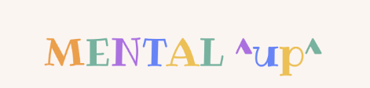
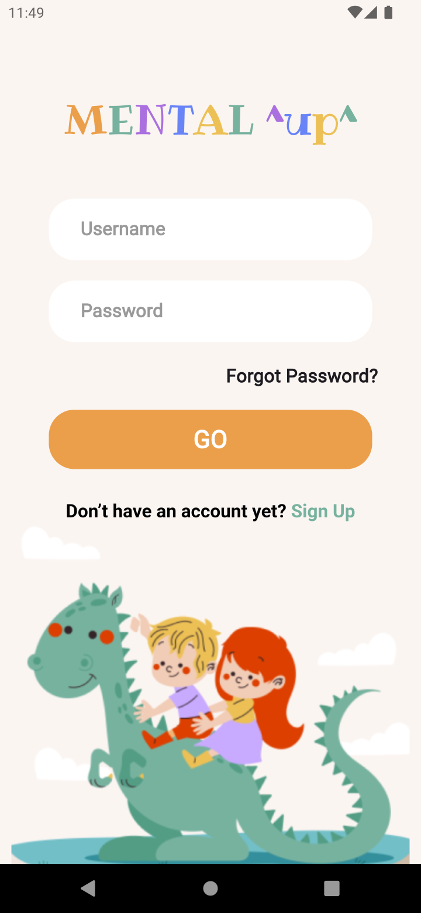
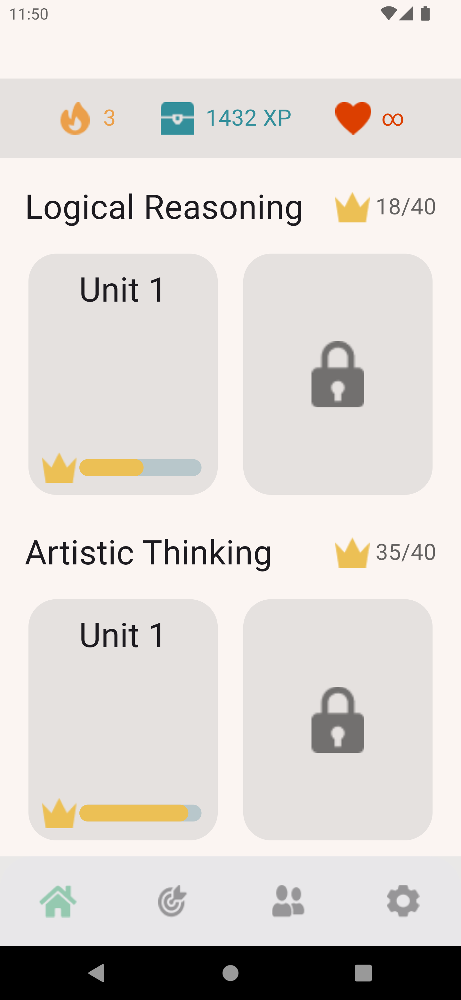
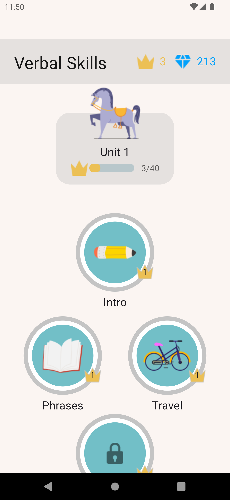
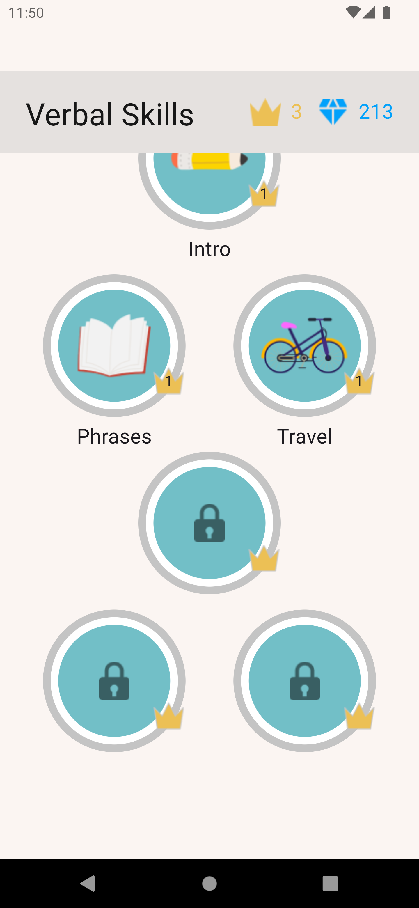
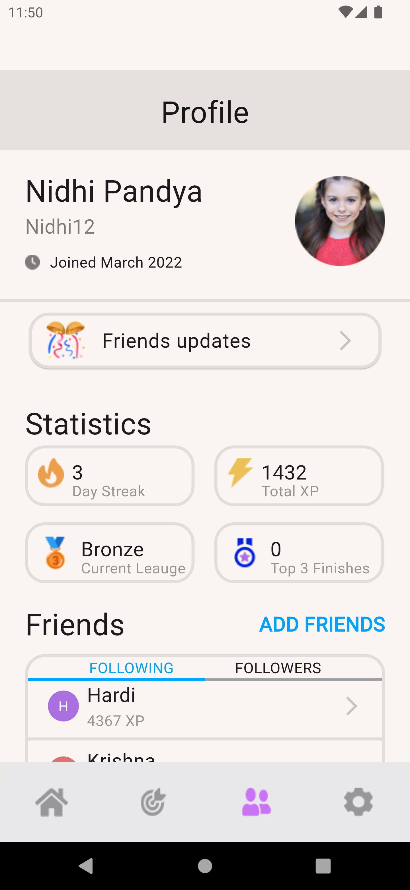
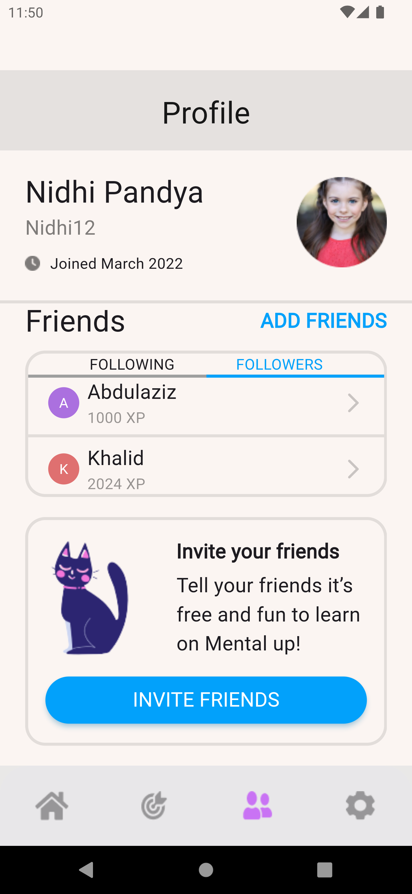
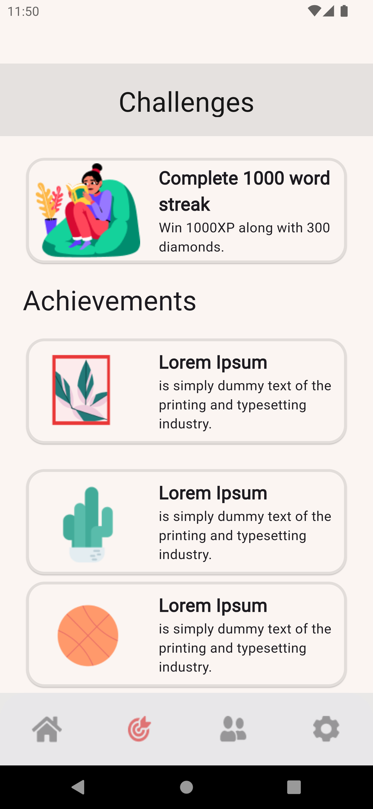

# Mental ^up^

This is a flutter project showing the UI implementation of an Education app for kids to improve their mental capacity while having fun.

## Description

The education app screens are implemented using flutter framework, it has visually pleasing UI especially for kids so that they can enjoy the many mental exercises this app offers.

## Work

- The long tree of widgets were separated in dart files for easier maintenance and readability.
- Used variables to pass to widgets to make it reusable
- Used default font declared in MaterialApp theme property
- Used conditional statements to render widgets based on the condition, such as Following and Followers in profile screen, they change color based on condition
- Widgets used: (Padding, SizedBox, Container, Column, Row, Stack, Card, ListTile, SingleChildScrollView, Expanded, Text, Flexible, Center, Align, InkWell, Divider, Icon, Image, and others including Custom Widgets)
- Used indent and endIndent properties of Divider to colorize part of the Divider upon clicking an option
- Wrapped ListTile with Card to fix a problem during scrolling down (ListTile borders show behind other widgets)
- Used a package called GetWidget that contains GFProgressBar widget, used in Topic Screen for the progress bar

- Issues and things to improve:

*Navigation: used pushReplacement so when user moves to another page, the previous page gets disposed.*
*Could not place crown on top of GFProgressBar as shown in UI.*
*The colors of Navigation Bar images are lighter than in design.*

## UI

- Note: A video of UI is uploaded in assets/video

**Login Screen: The first page of the app, colorful and welcoming**

**Home Screen: The topics screen, where users can choose the topic they are interested in.**
**It also contains details of the crowns and xp collected**

**Topic Screen: Where users can choose the subject to complete and unlock next subjects for that unit**

**Locked subjects!! Unlock it by collecting more XP**

**Profile Screen: The app allows users to follow each other to compare progress**

**Make friends and progress together!!**

**Challenges Screen: This page shows the achievements earned**
**And new challenges to overcome**

- Finally, stay tuned for more topics and fun subjects...!!

## Help
If you encounter any issues:
- Make sure you have all the necessary dart files within the project
- Contact us so that we can help resolve the problem

## Authors
Abdulaziz Alamri

## Version History
**See commits history for more details**
- organized LoginScreen, separated code into custom widgets
- finished ChallengesScreen and made minor changes in topicScreen
- finished ChallengesScreen and added its widgets (challenge_card, challenges_section)
- finished ProfileScreen, widgets created (ProfileCard, StatisticsSection, StatisticsCard, FriendsSection, FriendsCard, InviteFriendsCard)
- finished TopicScreen, organized widgets folder (home, topic)
- finished TopicScreen (added bottom_navigation.dart and home_icons.dart and topic_box.dart)
- changed HomeScreen to LoginScreen and created HomeScreen
- finished HomeScreen UI
- created flutter project education_app and added home_screen.dart

## Acknowledgments
Tuwaiq Academy

