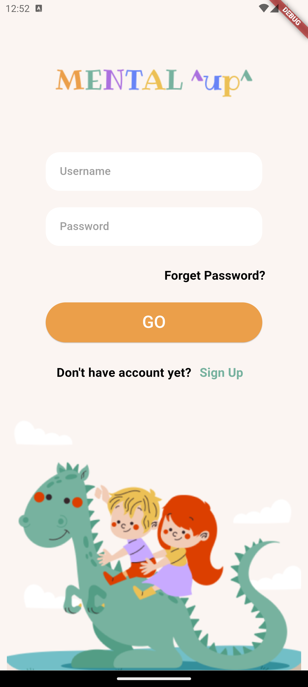

## Project-3 (education kids game) :
The projrct is an education kids game that provaide different types of subjects each of them consists of units, to finish the units it keep track of kids progress in each skills in that unit. kids can have thire profile and add friends, and try the  challenges.  

## project Details:

#### - SignInScreen:
 It was created useing column to view the logo image than the TextsFilds for username and password, texts, image. the ElevatedButton that will navgite to next page (HomeScreen) and SizedBox() to spreate between them

#### - HomeScreen:

- Appbar bottom: with Container as a child to orgnaze and show the appBar element 

for the body i useed column and three custom widgets

- CourseTitle : to show the course title and it' detiels

- UnitWidget : styled Container to show the unit detiels. the last unit will navgite to CoursePage

- LockUnit : to show lock units

I also used SingleChildScrollView() widget to scroll 

#### - CourseScreen:
starting with the same Appbar in HomeScreen but with differnet elements,

for the body i useed column, stack and custom widget
- stack: to orgnaize the view of the unit Container, i used stack to handel overlap image.

- SkillWidget: desgined Container take the skill title and image url to view the skill.

I also used SingleChildScrollView() widget to scroll 

#### - ChallengesScreen:

You can navgatie to this page using the AppNavicationBar.

same Appbar in HomeScreen but with page title only,

for the body i used ListView, column and custom widget
- ListView: to make page scrollable and add padding.

- AchievementsCardWidget: desgined Container take the achievements title, subtitle and image url to view the achievements.

#### - ProfileScreen:

You can navgatie to this page using the AppNavicationBar.

same Appbar in HomeScreen but with page title only,
- before the Scaffold i used DefaultTabController to add tabBar later

for the body i used Column, Stack, ListTile, CustomCardWidget and tapBar

- Stack: to orgnaize the view of the profile, i used stack to handel each element position.
- CustomCardWidget: to show the statStatistics i used rowa to organize them.

- Container with tabBar: desgined Container with column as a child, it will take tabBar and ListTile as children .

- last is Container with texts widgets desgin in colmun and row than an styled ElevatedButton.

#### - Additional pages:
- CurrentPage: to manage the navigation between main pages.

- CustomIcons: added custom icones 

## project output:

#### - SignInScreen:

#### - HomeScreen:

#### - CourseScreen:

#### - ChallengesScreen:

#### - ProfileScreen:

## Author:
Rahaf Alghamdi
