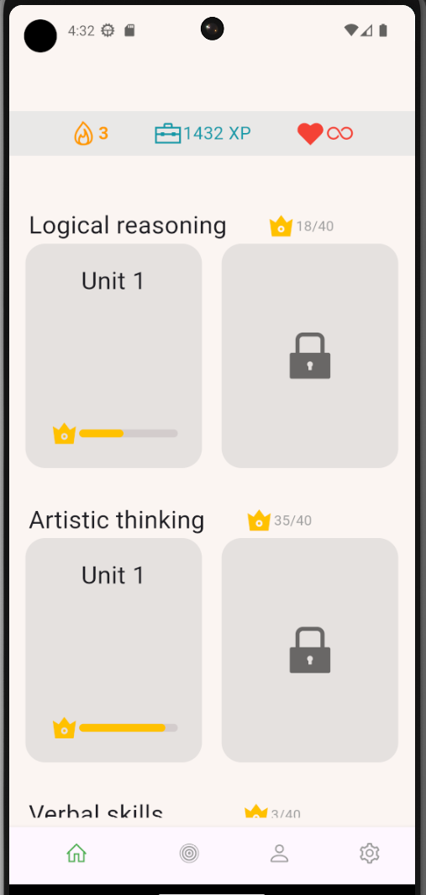
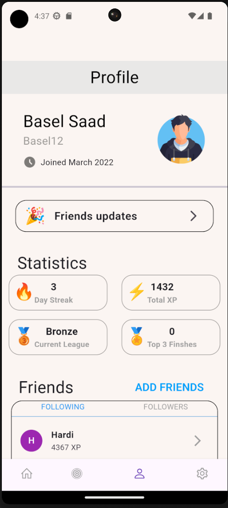
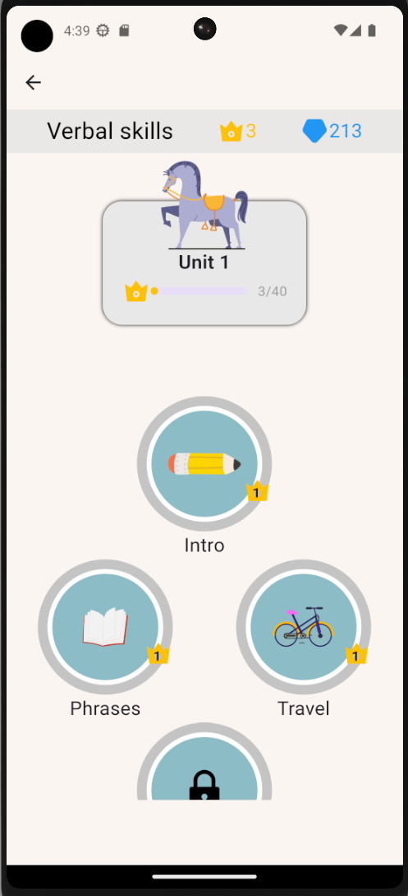

# educational_kids_game 🎮🎯

A new Flutter project for creating creative UI for Kids game applcation.

## Main Screens

### Login

#### Main Widget
- `CustomTextFeild`
- `TextButton`
- `SafeArea`

### Section

#### Main Widget
- `SingleChildScrollView`
- `SizedBox`
- `Icon`

### Challenges

#### Main widget
- `Align`
- `Row`
- `Image`

### Profile

#### Main widget
- `ListTile`
- `TextButton`
- `Container`

### Unit

#### Main Widget
- `Stack`
- `Column`
- `Text`

#### Other Widget
- BottomNavigationBar , AppBar ...etc

## OutPut

Feel free to use with account name mentioned

by `Basel-75` Github