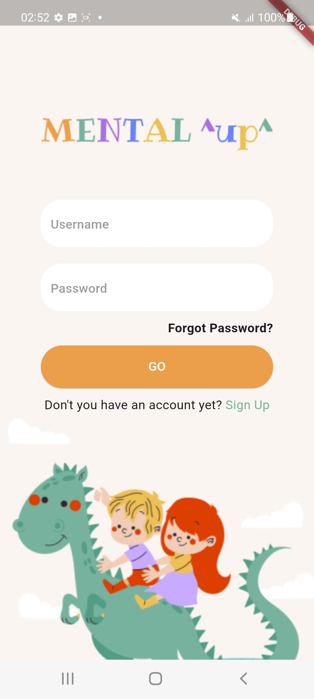
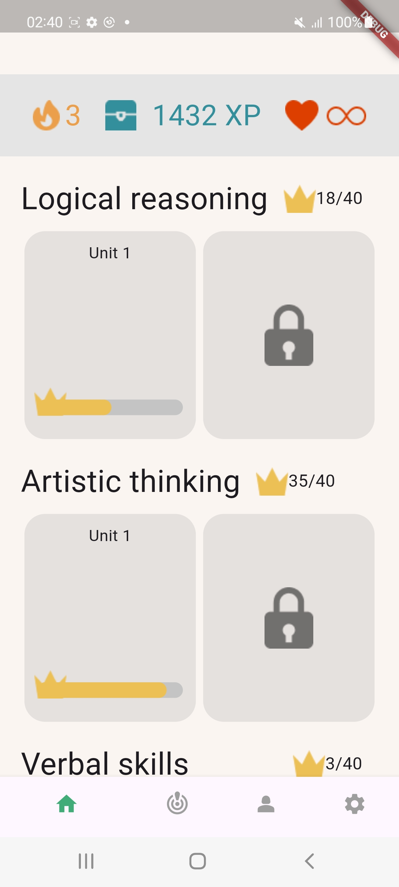
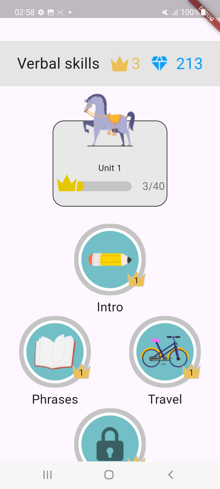
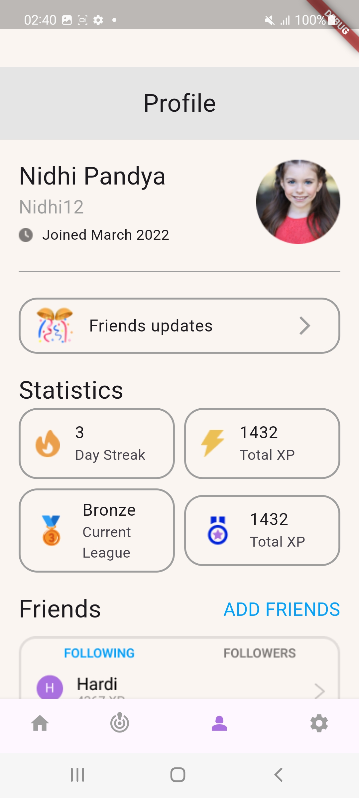
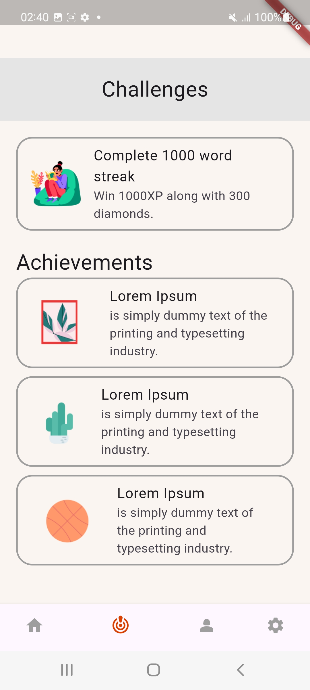

# Educational Kids Game

This Flutter project showcases the UI implementation of an educational app designed for kids to enhance their skills while having fun.

## Description

The app's screens are developed using Flutter, featuring a visually appealing UI tailored for children to enjoy a variety of mental exercises offered by the app.

## Features

- **Code Organization:** The extensive widget tree is divided into separate Dart files for better maintenance and readability.
- **Reusability:** Variables are used to pass data to widgets, promoting reuse.
- **GetWidget Package:** Integrated `GFProgressBar` from the `GetWidget` package for progress bars on the home Screen.
- **Widgets Used:** Includes `Padding`, `SizedBox`, `Container`, `Column`, `Row`, `Stack`, `ListTile`,  `Expanded`, `Text`, `Center`, `Align`, `InkWell`, `Divider`, `Icon`, `Image`, `Divider`,and custom widgets.

## UI Screenshots

- **Login Screen:** The initial page of the app, colorful and inviting.

- **Home Screen:** Displays topics, crowns, and XP details.

- **Verbal skills Screen:** Users select subjects to complete and unlock subsequent topics.

- **Profile Screen:** Allows users to follow each other and compare progress.

- **Challenges Screen:** Shows achievements and new challenges to conquer.

## UI Screen recording

<video controls src="lib/assets/readme/recording.mp4" width="300" height="700">
