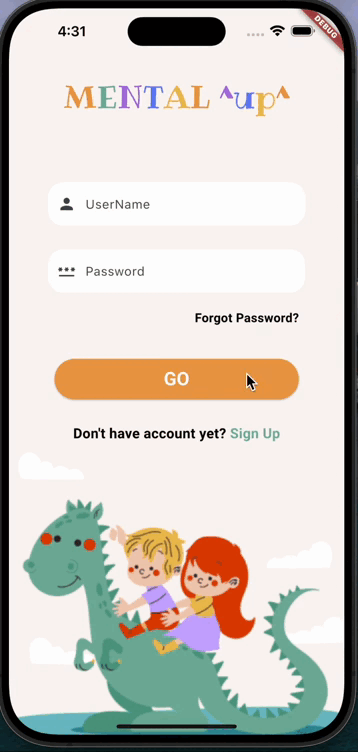

<p align="center">


# Educational Kids Game
A Flutter UI Project with a set of user interfaces utilizing a variety of Flutter widgets. This includes, but is not limited to:

- `Column` and `Row` for flexible layouts
- `ListView` for scrollable content
- `AppBar` for the top app bar
- `Text` for text
- `Icon` for graphical elements
- `Button` for interactive actions
- `Image` for displaying visuals
- `Card` for a material design card
- `BottomNavigationBar` for navigation at the bottom

This UI will showcase a functional and visually appealing design, demonstrating the versatility of Flutter’s widget library.

#
## Getting started
 ### Dependencies
You need to install the Dart programming language and Flutter framework.

### Executing program
1- Copy url then go to terminal and write: 
```
git clone ‹url›
```
2- Go to the cloned project using:
```
 cd < PROJECT-NAME> /
 ``` 

3- To create and start dart project 
```
dart create project_name
cd project_name
code .
```

4- The program is now ready to run.


## App Overview

This application features a straightforward design with six distinct screens:

1- Login Screen:
- The initial screen requires users to enter a **username** and **password**. If either field is left empty, an error message will be displayed.

2- Home Screen:
- After logging in, users are directed to the `HomeScreen`. This screen includes an `AppBar` displaying user data and a `BottomNavigationBar` for seamless navigation between screens. The body of the Home screen features various sections such as **Logical Reasoning**, **Artistic Thinking**, and **Verbal Skills**.Each section is represented with a `LinearProgressIndicator` that visually shows progress. Sections can be either open or closed, depending on user interaction and progress.

3- Verbal Skills Screen:
 - Accessed from the `HomeScreen`, this screen includes an `AppBar` with the title **Verbal Skills** and user data. The body of this screen is organized into different sections, such as **Intro**, **Phrases**, and **Travel** as well as other sections that may be closed.

4- Challenges Screen:
- Users can navigate to the `ChallengesScreen` from the `HomeScreen` via the `BottomNavigationBar`. This screen features cards displaying various **challenges** and **achievements**.

5- Profile Screen:
- Accessible through the `BottomNavigationBar`, this screen presents user information, including **name**, **username**, **profile picture**, and **join date**. It also includes cards for **friend update**s, **statistics**, and **inviting friends**, along with a `ContainedTabBarView` for **following** and **followers**.

6- Settings Screen:
- The final screen is dedicated entirely to the `AppBar`, which appears with the title `Setting` only. 


## OutPut
The outcome of the project:


<p align="center">



## Language and freameWorkes
- Dart programming language
- Flutter framework

## Created by
**Yara Albouq**