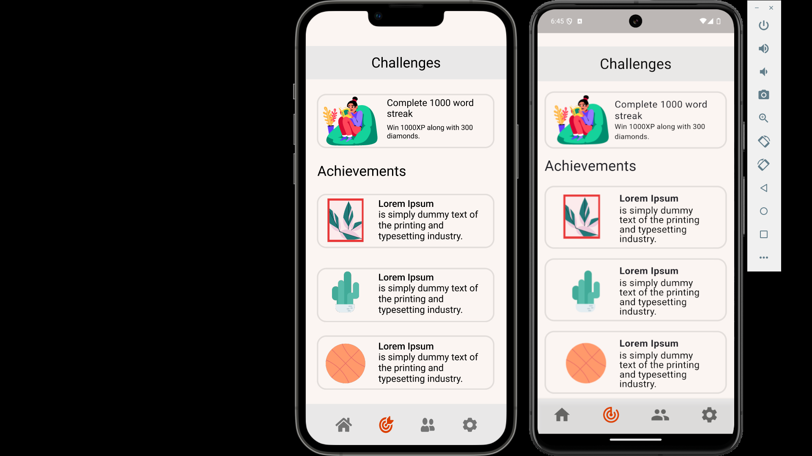
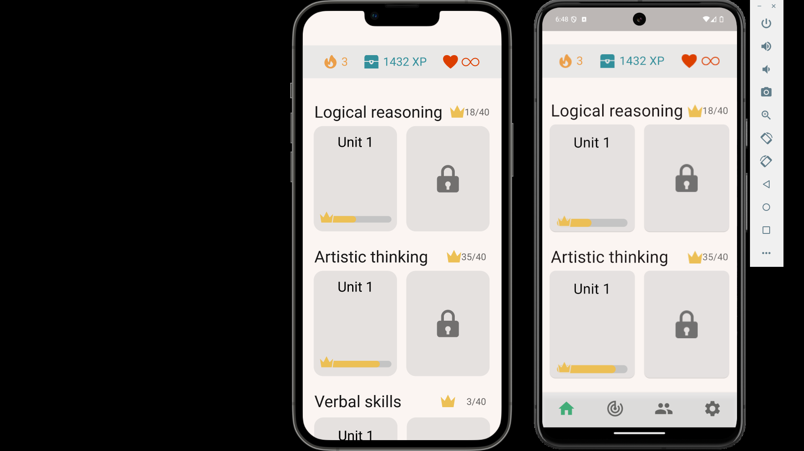
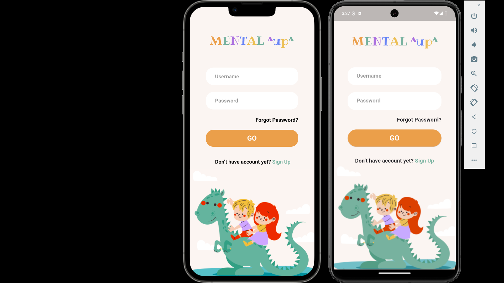
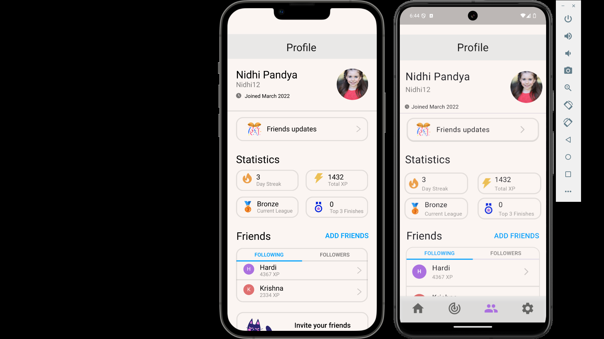

# Project 3 : Educational Kids Game

## 1. Overview 📖
MENTAL ^up^ is an educational application for kids that contains many learning courses.\
The app interfaces designed in figma are kids-friendly and attractive for children.

## 2. Widgets Used 🎨
Two types of widget were used to complete this project

### 2.1 Basic Widgets
##### 2.1.1 Column and Row : used for layout
##### 2.1.2 SizedBox : used for spacing and containing other widget
##### 2.1.3 TextField : used for getting input from user

### 2.2 Custom Widgets
In this section, I will explain some of the custom widgets I built to improve\
reusability of widgets across screens.

##### 2.2.1 UserInput : this widget is for special user input that is repeated many times.
##### 2.2.2 Friend : this widget represents friend in profile page.
##### 2.2.3 Course : this widget represent a course in home page.

## 3. Output ⭐
Design (left) VS Code (Right)

Challenges

Home

Login

Profile

<video controls src="readme_media/results.mp4" title="Title"></video>

## 4. Conclusion 🏁
This application contains a lot of widgets that makes the user interface more friendly.